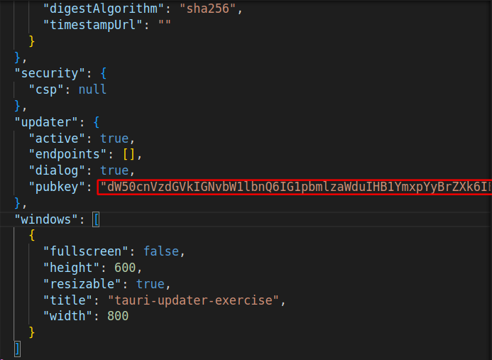
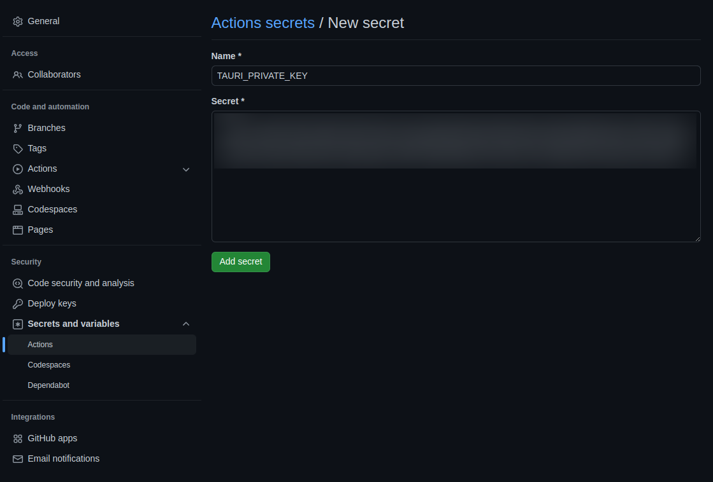
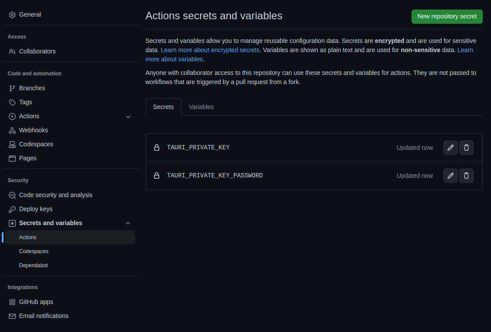
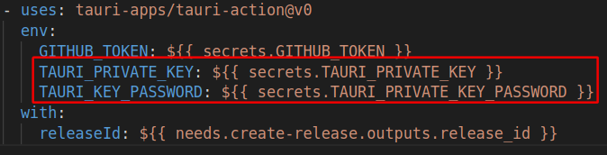

# Tauri Updater with github 練習

## 1. 安裝全域 tauri
```
pnpm i -g @tauri-apps/cli
```

## 2. 生成簽名 
```bash
# tauri signer generate -w ~/.tauri/{app_name}.key

tauri signer generate -w ~/.tauri/tauri_updater.key
```

## 2. Tag
```bash
# 生成 Tag
# git tag app-v{version}

git tag v0.0.1

# 上傳 Tag

git push --tag
```

## 3. 在 tauri.conf.json 填上公鑰


## 4. 在 github action 新增 secret


## 4. 新增好 private_key & password


## 4. 在 yml 加上剛剛新增好的 secret
